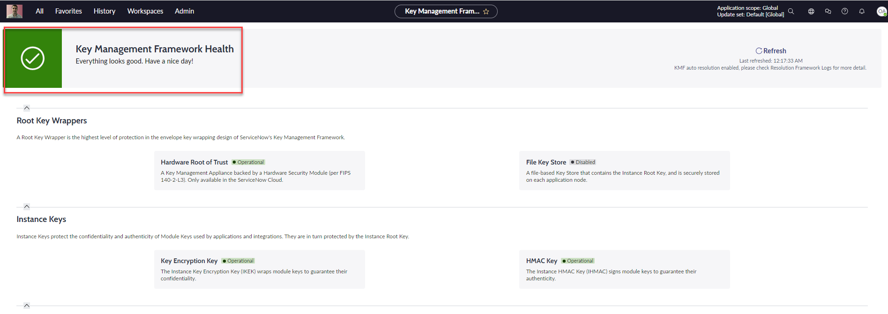
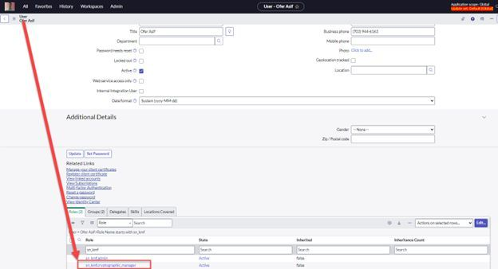
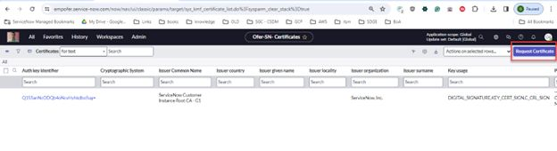
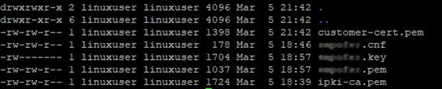
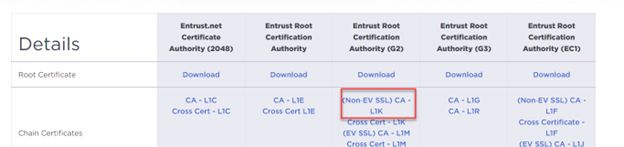
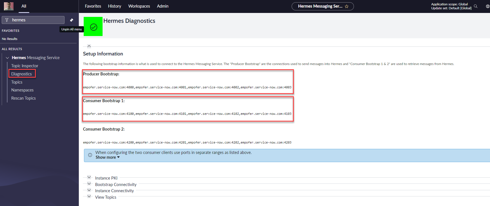
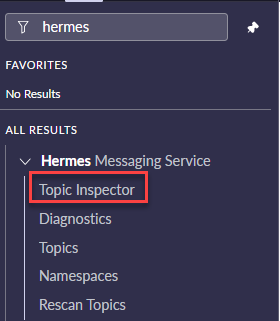

# Stream Connect
### Install Kafka on a Linux-based VM
* Follow https://www.linuxtechi.com/how-to-install-apache-kafka-on-ubuntu/
### Setup for direct instance connection through Hermes
* Pre-requisites
    - Make sure that your instance can be accessed via the adcv2 load balancer. If it is not, you will need to create a case to migrate your instance from F5 to ADCV2. Check using the following URL: **https://\<InstanceName>.service-now.com/adcv2/server**
    - **com.glide.kmf.global** plugin must be installed
    - Check **https://\<InstanceName>.service-now.com/now/key-management-framework/health**
    
    - Check Hermes status **\<InstanceName>.service-now.com/xmlstats.do?include=services_status**
    - Verify that the user is assigned **sn_kmf.cryptographic_manager** role. If the user cannot see the role or if the user cannot access the **sys_kmf_certificate.list** then it is likely that you will need to create a case to enable Hermes service on the instance 

### Create a truststore and a keystore to connect 
1. Create a directory to store the files. ex: `mkdir hermes`
2.  sys_kmf_certificate.list open the root certificate copy the PEM certificate and paste it into **ipki-ca.pem** file
3. Create <InstanceName>.cnf file with the following content:
    ```
    prompt=no
    encrypt_key=no
    distinguished_name=req_dn
    default_md=sha256
    [req_dn]
    CN=<Root Cert's Subject Common Name>
    O=<Root Cert's Subject organization>
    GN=Customer-Kafka
    SN=<Instance ID from the stats page>
    ```
4. Generate a PEM-encoded Certificate Request (CSR) by running the following command: 
    ``` 
    openssl req -new -newkey rsa:2048 -nodes -config <instance_name>.cnf -keyout <instance_name>.key -out <instance_name>.pem 
    ```
5. Back at the instance certificate table, click request certificate
    
6. After uploading the certifiate request, open the new signed certificate record, copy the PEM Certificate text and paste it into the **customer-cert.pem** file. The directory should contain the following files:
    
7. Create a keystore using the following command:
    ```
    openssl pkcs12 -export -out keystore.p12 -inkey <instance_name>.key -in customer-cert.pem -certfile ipki-ca.pem 
    ```
8. To generate a truststore we need to download an Entrust Certificate authority. In a Web browser, visit the https://www.entrust.com/resources/tools/root-certificate-downloads and download the chain certificate, selecting (Non EV SSL) CA - L1K.
    
    ```
    wget https://web.entrust.com/root-certificates/entrust_l1k.cer
    ```

9. Create the truststore with the following command:
    ```
    keytool -keystore truststore.p12 -alias entrust -import -file entrust_l1k.cer
    ```
10. With the trustsore and the keystore files we can now exchange messages with the instance.
### Produce and consume messages
1. Create a new directory and copy the keystore and the truststore files to it
    ```
    mkdir demo
    cp *.p12 /demo
    ```
2. Create two configuration files in the new demo directory
    * consumer.properties
        ```
        security.protocol=SSL
        ssl.truststore.password=<truststore password>
        ssl.truststore.location=<full path>/demo/truststore.p12
        ssl.truststore.type=PKCS12
        ssl.keystore.password=<keystore password>
        ssl.keystore.location=<full path>/demo/keystore.p12
        ssl.keystore.type=PKCS12
        ssl.key.password=<keystore password>
        ```
    * producer.properties
        ```
        security.protocol=SSL
        ssl.truststore.password=<truststore password>
        ssl.truststore.location=<full path>/demo/truststore.p12
        ssl.truststore.type=PKCS12
        ssl.keystore.password=<keystore password>
        ssl.keystore.location=<full path>/demo/keystore.p12
        ssl.keystore.type=PKCS12
        ssl.key.password=<keystore password>
        ```
3. In the instance, **sys_kafka_topic.list** add a topic. For example: demo-topic
4. Navigate to the Hermes Diagnostic page and copy the producer and consumer bootstrap
    
5. <u>**List topics**</u>: In Kafka Linux issue the following command from the same location as the producer.properties (demo directory):
    ```
    /usr/local/kafka/bin/kafka-topics.sh --command-config producer.properties --bootstrap-server <InstanceName>.service-now.com:4000,<InstanceName>.service-now.com:4001,<InstanceName>.service-now.com:4002,<InstanceName>.service-now.com:4003 --list
    ```
    - Note the full path to kafka-topics.sh script and the producer bootstrap from step 3
    - Note that the demo-topic that was created in step 1 has a prefix on snc.<InstanceName>, which is the default namespace
6. <u>**Produce Messages**</u>: In Kafka Linux issue the following command from the same location as the producer.properties (demo directory):
    ```
    /usr/local/kafka/bin/kafka-console-producer.sh --topic snc.<InstanceName>.demo-topic --producer.config producer.properties --bootstrap-server <InstanceName>.service-now.com:4000,<InstanceName>.service-now.com:4001,<InstanceName>.service-now.com:4002,<InstanceName>.service-now.com:4003
    ```
    - Note the full path to kafka-console-producer.sh script and the producer bootstrap from step 3
    - Note the topic name include the prefix as listed in step 5
    - Note that the demo-topic that was created in step 1 has a prefix on snc.\<InstanceName>, which is the default namespace
    - On the instance, inspect the messages using the Topic Inspector
    
7. <u>**Consume Messages**</u>: In Kafka Linux issue the following command from the same location as the consumer.properties (demo directory):
    ```
    /usr/local/kafka/bin/kafka-console-consumer.sh --consumer.config consumer.properties --topic snc.<InstanceName>.ofer --from-beginning --bootstrap-server <InstanceName>.service-now.com:4000,<InstanceName>.service-now.com:4001,<InstanceName>.service-now.com:4002,<InstanceName>.service-now.com:4003 --group snc.<InstanceName>.demo
    ```
    - Note the full path to kafka-console-consumer.sh script and the consumer bootstrap from step 3
    - Note the topic name include the prefix as listed in step 5
    - Note that the demo-topic that was created in step 1 has a prefix on snc.\<InstanceName>, which is the default namespace


